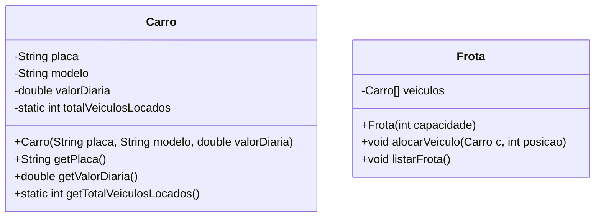

# 🎓 Guia de Estudo: Atributos e Métodos de Classe (POO em Java)
*Focado na Aula IMES e no Contexto de Negócios da Revloc*

Este guia foi estruturado em conjunto pelos seus **Agentes de Ensino** para garantir que você compreenda perfeitamente a diferença entre conceitos de **Instância** e de **Classe (Estáticos)** em Programação Orientada a Objetos (POO), fixando o conteúdo de forma definitiva.

---

## 🤖 Painel dos Agentes de Ensino

Para esta jornada, ativamos três mentores especialistas:

1. **🏫 O Professor Didático (Teoria & Analogias):** Responsável por traduzir códigos áridos em metáforas do mundo real.
2. **💻 O Desenvolvedor Sênior (Prática & Sintaxe):** Focado nas regras de compilação em Java, boas práticas de escrita e funcionamento da memória.
3. **💼 O Analista de Operações (Contexto de Negócios):** Conecta a programação ao ecossistema de frotas da **Revloc**, mostrando onde esse conhecimento gera valor estratégico.

---

## 💡 Capítulo 1: O Conceito de Instância vs. Classe (Estático)

### 🏫 O Professor Didático explica:
Imagine que você tem a **planta de engenharia (blueprint)** de uma fábrica de automóveis. A planta em si não é um carro, ela é apenas o molde.
* **Instância (Objeto):** Cada carro que sai da linha de montagem é uma *instância*. O Corolla azul do Hugo é uma instância; o Fiesta vermelho da Milena é outra. Se o Hugo pintar seu carro de amarelo, o carro da Milena continua vermelho. Isso são **atributos de instância**. Eles pertencem ao objeto individual.
* **Classe (Estático):** Agora, imagine o letreiro da fábrica na parede de entrada ou o manual geral de engenharia do modelo. Se a montadora decide alterar o nome da marca de "Toyota" para "Toyota Motors", essa mudança vale para *toda a fábrica* e afeta a identidade de todos os carros produzidos. Um contador de quantos carros saíram da fábrica também pertence à fábrica como um todo, não a um carro específico. Isso é um **atributo de classe (ou estático)**.

---

### 💻 O Desenvolvedor Sênior explica:
Em Java, a diferença técnica reside na palavra-chave `static`.

```java
public class Carro {
    // ATRIBUTOS DE INSTÂNCIA (Sem a palavra "static")
    // Cada carro criado terá sua própria cópia destas variáveis na memória Heap.
    private String marca;
    private String modelo;

    // ATRIBUTO DE CLASSE / ESTÁTICO (Com a palavra "static")
    // Existe apenas UMA única variável na memória (Method Area) compartilhada por todos os carros.
    private static int totalCarros;
}
```

#### A Regra de Ouro do Acesso a Dados:
1. **Métodos de Instância (Não estáticos):** Podem ler e alterar tanto variáveis de instância (`this.marca`) quanto variáveis estáticas (`totalCarros`).
2. **Métodos Estáticos (De classe):** **SÓ podem acessar variáveis estáticas.** Eles não sabem o que é `this.marca` porque são chamados diretamente na Classe, sem precisar que um objeto exista.

> [!WARNING]
> **Erro clássico de compilação:** Tentar chamar `this.marca` ou acessar um atributo não-estático de dentro de um método estático. O compilador Java emitirá o erro: `Non-static field 'marca' cannot be referenced from a static context`.

---

## 💼 Capítulo 2: O Caso Real (Operações Revloc)

Vamos aplicar esses conceitos na modelagem de software para a **Revloc Frotas**.
Precisamos controlar o número total de veículos sob contrato de locação e as propriedades específicas de cada veículo individual.

### Estrutura do pátio operacional



---

## 🛠️ Passo a Passo Prático (Para Nunca Mais Esquecer)

Siga este roteiro mental ou de codificação para consolidar o aprendizado.

### Passo 1: Construindo a classe com Atributos de Instância e de Classe
Crie uma classe `Carro` onde cada objeto tem sua identidade (placa, modelo, valor diário), mas a classe sabe o volume geral da operação (`totalVeiculosLocados`).

```java
public class Carro {
    // Atributos de Instância: específicos de cada veículo
    private String placa;
    private String modelo;
    private double valorDiaria;

    // Atributo de Classe: comum a toda a Revloc
    private static int totalVeiculosLocados = 0;

    // Construtor: Toda vez que um carro é alugado/criado, incrementamos o total estático
    public Carro(String placa, String modelo, double valorDiaria) {
        this.placa = placa;
        this.modelo = modelo;
        this.valorDiaria = valorDiaria;
        
        // Aumenta o contador compartilhado por todas as instâncias
        totalVeiculosLocados++;
    }

    // Métodos de Instância: precisam de um carro específico para rodar
    public String getPlaca() {
        return this.placa;
    }

    public String getModelo() {
        return this.modelo;
    }

    public double getValorDiaria() {
        return this.valorDiaria;
    }

    // Método Estático / de Classe: pode ser chamado diretamente sem criar nenhum carro
    public static int getTotalVeiculosLocados() {
        return totalVeiculosLocados; 
        // ATENÇÃO: Se você colocar "return this.modelo;" aqui, o Java quebra!
    }
}
```

### Passo 2: O Gerenciador da Frota
Crie uma classe `Frota` que agrupa esses carros. Ela representa um pátio ou contrato de locação físico.

```java
public class Frota {
    // Atributo de instância: cada pátio/frota possui seu próprio array de veículos
    private Carro[] veiculos;

    public Frota(int capacidade) {
        this.veiculos = new Carro[capacidade];
    }

    // Adiciona um veículo em uma vaga específica do pátio
    public void alocarVeiculo(Carro carro, int vaga) {
        if (vaga >= 0 && vaga < veiculos.length) {
            veiculos[vaga] = carro;
        }
    }

    // Retorna todos os veículos
    public Carro[] getVeiculos() {
        return veiculos;
    }

    // Lista os veículos e calcula a receita diária projetada
    public void listarFrota() {
        System.out.println("=== RELATÓRIO OPERACIONAL DE FROTA ===");
        double receitaTotal = 0;
        for (int i = 0; i < veiculos.length; i++) {
            if (veiculos[i] != null) {
                System.out.println("Vaga " + i + ": Modelo: " + veiculos[i].getModelo() + " | Placa: " + veiculos[i].getPlaca());
                receitaTotal += veiculos[i].getValorDiaria();
            }
        }
        System.out.println("Receita Diária Estimada da Frota: R$ " + receitaTotal);
    }
}
```

### Passo 3: Executando e Entendendo a Memória (Classe Principal)
Agora, observe como acessamos cada tipo de método.

```java
public class Main {
    public static void main(String[] args) {
        // 1. Verificando o contador estático ANTES de criar carros
        // Chamada via NOME DA CLASSE (não precisamos de objeto)
        System.out.println("Veículos locados no início: " + Carro.getTotalVeiculosLocados()); // Imprime 0

        // 2. Criando instâncias de veículos (carros reais da Revloc)
        Carro c1 = new Carro("ABC-1234", "Fiat Uno", 80.0);
        Carro c2 = new Carro("XYZ-9876", "Chevrolet Onix", 120.0);
        Carro c3 = new Carro("KGB-0007", "Toyota Corolla", 250.0);

        // 3. Alocando na nossa Frota do pátio Central
        Frota patioCentral = new Frota(3);
        patioCentral.alocarVeiculo(c1, 0);
        patioCentral.alocarVeiculo(c2, 1);
        patioCentral.alocarVeiculo(c3, 2);

        // 4. Imprimindo o relatório operacional (método de instância do pátioCentral)
        patioCentral.listarFrota();

        // 5. Verificando o contador estático DEPOIS de criar os carros
        // Como o atributo é estático, o incremento dentro do construtor afetou a classe global
        System.out.println("Total de veículos ativos na Revloc: " + Carro.getTotalVeiculosLocados()); // Imprime 3
    }
}
```

---

## 🧠 Hacks Mentais de Fixação Rápida

> [!TIP]
> **Use estas 3 perguntas no seu dia a dia de estudos para nunca mais esquecer:**
> 1. *"Essa informação depende de um item específico?"*
>    * Se **sim** (ex: cor do carro, placa, velocidade atual) ➡️ **Atributo/Método de Instância**.
>    * Se **não** (ex: contador geral, constantes matemáticas, regra global de validação) ➡️ **Atributo/Método Estático (Classe)**.
> 2. *Para chamar esse método, eu preciso digitar `new Classe()` antes?*
>    * Se **sim** ➡️ Método de Instância.
>    * Se **não** (posso fazer `Classe.metodo()`) ➡️ Método Estático.
> 3. *Tentar acessar um atributo de instância dentro de um método estático é o equivalente a perguntar para a fábrica de Corolla: "Qual é a placa do carro que você acabou de fabricar?" sem dizer qual carro específico você está olhando.* A fábrica responderá: *"Não sei de qual carro você está falando!"* (Esse é o erro de compilação do contexto estático).
