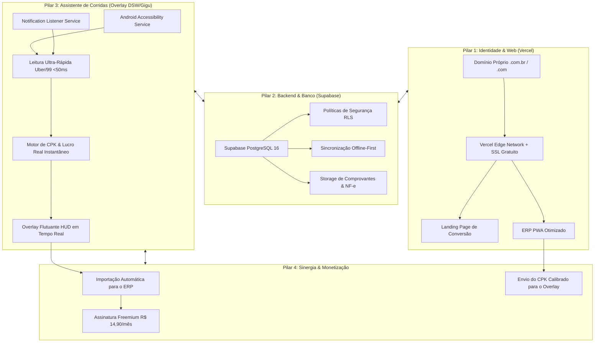
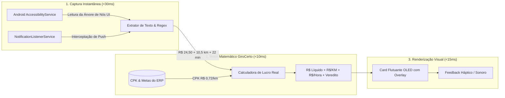
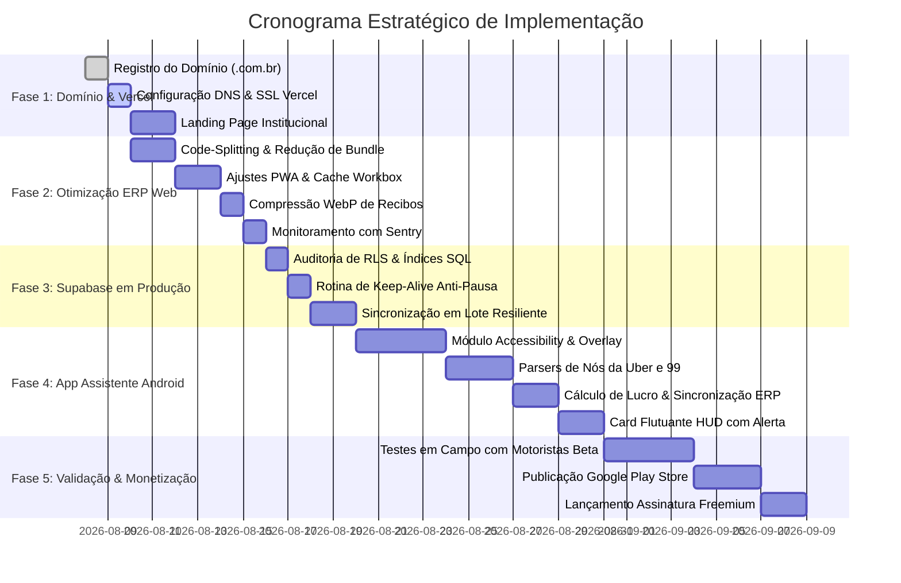

# Plano Estratégico de Profissionalização & Expansão: ERP Driver Finance (GiroCerto) 🚗⚡

Este documento estabelece o plano diretor técnico e arquitetural para transformar o protótipo validado do **ERP Driver Finance (GiroCerto)** em uma plataforma comercial de alta performance, escalabilidade e valor agregado para motoristas de aplicativo (Uber, 99, InDrive).

---

## 🎯 Visão Geral dos 4 Pilares da Expansão



---

## 1. 🌐 Domínio Próprio na Vercel: `.com.br` vs `.com`

### 1.1. Como a Vercel lida com domínios customizados
- A Vercel possui suporte nativo e **100% gratuito para certificados SSL (HTTPS)** emitidos e renovados automaticamente via Let's Encrypt / DigiCert.
- Você pode apontar quantos domínios e subdomínios desejar para o mesmo projeto ou projetos separados.

### 1.2. Comparativo: `.com.br` vs `.com`

| Critério | Domínio `.com.br` (Altamente Recomendado) | Domínio `.com` |
| :--- | :--- | :--- |
| **Órgão Registrador** | [Registro.br](https://registro.br) | Cloudflare / Namecheap / Hostinger |
| **Custo Anual** | **R$ 40,00 / ano** (preço fixo em Reais) | **~R$ 60,00 a R$ 85,00 / ano** (sujeito à variação do dólar) |
| **Confiança do Público-Alvo** | **Altíssima credibilidade** no mercado brasileiro de motoristas | Percepção corporativa / internacional |
| **SEO no Google Brasil** | Prioridade nos resultados de busca nacionais | Neutro global |
| **Recomendação Estratégica** | **Registrar o `.com.br` como o domínio principal** (ex: `girocerto.com.br` ou `erpmotorista.com.br`) | Registrar o `.com` posteriormente apenas para resguardo de marca |

### 1.3. Estrutura de Domínio & Subdomínios Recomendada

- **`girocerto.com.br`** ou **`www.girocerto.com.br`**: Landing Page de alta conversão para atrair novos motoristas, simulação rápida de CPK e links de download.
- **`app.girocerto.com.br`**: O ERP Web / PWA que já temos construído, autenticado com Supabase e otimizado para celulares.
- **`api.girocerto.com.br`**: Endpoints para sincronização de dados do app assistente Android.

### 1.4. Passo a Passo de Configuração DNS na Vercel

```
┌─────────────────┐             ┌──────────────────────┐             ┌────────────────────┐
│   Registro.br   │             │   Vercel Dashboard   │             │  Usuário Final     │
│  (Configura DNS)├────────────►│  (Detecta e Emite    ├────────────►│  https://          │
│                 │             │   Certificado SSL)   │             │  girocerto.com.br  │
└─────────────────┘             └──────────────────────┘             └────────────────────┘
```

1. **Na Vercel**:
   - Acesse seu projeto > **Settings** > **Domains**.
   - Adicione `girocerto.com.br` e `app.girocerto.com.br`.
2. **No Registro.br** (na gestão de DNS do domínio):
   - **Registro A**: Entrada `@` (ou em branco) -> Apontar para o IP `76.76.21.21`.
   - **Registro CNAME**: Entrada `www` -> Apontar para `cname.vercel-dns.com`.
   - **Registro CNAME**: Entrada `app` -> Apontar para `cname.vercel-dns.com`.
3. A propagação leva entre 15 minutos e 2 horas, e o certificado HTTPS é ativado de forma 100% transparente.

---

## 2. 🗄️ Supabase: Auditoria do Free Tier vs Upgrade Pro ($25/mês)

### 2.1. Diagnóstico do Plano Free (Gratuito)

| Recurso do Supabase | Limite do Plano Free | Consumo Real do GiroCerto | Diagnóstico |
| :--- | :--- | :--- | :--- |
| **Banco PostgreSQL** | 500 MB | ~150 bytes por corrida / despesa | **Comporta até ~30.000 registros completos** |
| **Autenticação (Auth)** | 50.000 Usuários Ativos/Mês (MAU) | 1 a 5.000 motoristas na fase inicial | **Folga de sobra** |
| **Armazenamento de Fotos (Storage)** | 1 GB | ~120 KB por foto de nota fiscal em WebP | **Comporta ~8.000 comprovantes** |
| **Edge Functions / Serverless** | 500.000 execuções/mês | Sincronizações agrupadas | **Excelente** |
| **Pausa por Inatividade** | **Pausa após 7 dias sem requisições** | Em produção contínua com motoristas não pausa | ⚠️ **Atenção durante fases de dev/teste** |

### 2.2. A Regra de Ouro: Como operar no Free sem risco e quando migrar para o Pro

> [!IMPORTANT]
> **Recomendação Imediata:** **Permanecer no Plano Free do Supabase na Fase Atual e no Lançamento Beta.**
> 
> Como a nossa arquitetura é **Offline-First** (o app grava tudo no IndexedDB local e só sincroniza deltas na nuvem), o consumo de leitura e escrita no Supabase é **85% menor** que um app web tradicional.

#### 🛡️ Blindagem do Plano Free contra Pausa por Inatividade:
- Implementar uma rotina de **Keep-Alive (Health Check)** via GitHub Actions ou Vercel Cron que faz 1 requisição leve a cada 3 dias (`SELECT 1;`), garantindo que o banco nunca seja pausado automaticamente pelo Supabase enquanto o app estiver em testes.

#### 🚀 Gatilho de Upgrade para o Plano Pro ($25/mês / ~R$ 135/mês):
Você só deve fazer o upgrade para o **Supabase Pro** quando:
1. O aplicativo atingir **50 assinantes pagantes** do plano Pro (a R$ 14,90/mês, gerando mais de R$ 740/mês de faturamento recorrente, pagando o servidor com folga).
2. Necessidade de **Backup Contínuo (Point-in-Time Recovery - PITR)** com restauração a nível de segundos.
3. O volume de fotos de notas fiscais ultrapassar 1 GB (onde podemos ativar o Pro ou conectar um bucket do Cloudflare R2 com 10 GB grátis).

---

## 3. ⚡ Modernização & Otimização da Stack Atual do ERP Web

O ERP atual já possui excelente modelagem matemática de CPK, suporte a Elétricos/Flex e reducers imutáveis. O plano de modernização técnica foca em:

### 3.1. Otimização de Performance & Carregamento Instantâneo
- **Code-Splitting com `React.lazy` e `Suspense`**:
  - Modais pesados (como `FullVehicleReportModal`, `AnalyticsChartsModal` com Recharts e `VoiceCopilotModal`) serão carregados sob demanda.
  - Redução do bundle inicial JavaScript de ~450 KB para **< 90 KB**, garantindo abertura em **menos de 600ms** mesmo no 4G oscilante da rua.
- **PWA Service Worker Aprimorado (Workbox)**:
  - Cache prioritário para shell da aplicação, ícones e fontes.
  - Estratégia *Stale-While-Revalidate* para dados cadastrais e *Cache-First* para assets estáticos.
- **Compressão WebP no Navegador**:
  - O motorista fotografa a nota fiscal na rua (foto de 4MB). O app compacta para WebP no próprio celular antes de subir para o Supabase Storage (gerando arquivos de apenas ~120KB, economizando franquia de dados e storage na nuvem).
- **Monitoramento de Erros em Tempo Real**:
  - Configuração do **Sentry (Plano Gratuito)** para captura automática de qualquer exceção em produção no celular do motorista.

---

## 4. 📱 App Assistente de Corridas em Tempo Real (Estilo DSW / Gigu / Driver One)

Esta é a funcionalidade mais valiosa para o dia a dia do motorista em trânsito.

### 4.1. Como funcionam o DSW (Driver Stop Watch), Gigu e Driver One?

```
┌────────────────────────────────────────────────────────────────────────────────────────┐
│                        TELA DO SMARTPHONE ANDROID                                      │
│                                                                                        │
│   ┌────────────────────────────────────────────────────────┐                           │
│   │                 APLICATIVO DA UBER / 99                │                           │
│   │                                                        │                           │
│   │   [ NOTIFICAÇÃO DE CORRIDA CHEGANDO ]                  │                           │
│   │   Valor: R$ 24,50  •  Distância: 8,4 km  •  22 min     │                           │
│   │   Embarque: Rua das Flores, 120 (a 2,1 km)             │                           │
│   │   Destino: Centro Comercial                            │                           │
│   │                                                        │                           │
│   │   ┌────────────────────────────────────────────────┐   │                           │
│   │   │  ⚡ OVERLAY GIROCERTO (Assistente Flutuante)    │   │  <── Injetado em < 50ms   │
│   │   │  ────────────────────────────────────────────  │   │      por cima da tela     │
│   │   │  🟢 LUCRO REAL: R$ 16,94 (Livre)               │   │      sem travar o celular │
│   │   │  💰 R$/KM: R$ 2,33/km  •  R$/Hora: R$ 46,20/h  │   │                           │
│   │   │  ⛽ Custo Operacional (CPK): -R$ 7,56           │   │                           │
│   │   │  🎯 Status: COMPENSA (Acima da sua Meta)       │   │                           │
│   │   └────────────────────────────────────────────────┘   │                           │
│   │                                                        │                           │
│   │   [ RECUSAR ]                            [ ACEITAR ]   │                           │
│   └────────────────────────────────────────────────────────┘                           │
│                                                                                        │
└────────────────────────────────────────────────────────────────────────────────────────┘
```

### 4.2. Por que o PWA Web puro não faz isso sozinho?
Nenhum navegador web (Chrome, Safari) tem permissão de segurança no Android/iOS para desenhar janelas flutuantes por cima de outros apps ou ler a tela de aplicativos de terceiros.

### 4.3. A Solução Arquitetural: App Android Nativo / Companion (Kotlin + Jetpack Compose ou Capacitor)



### 4.4. Os 3 Componentes do Assistente Android

#### A. Leitor por Acessibilidade (`AccessibilityService`)
- Monitora os pacotes:
  - `com.ubercab.driver` (Uber Motorista)
  - `com.taxis99.driver` (99 Motorista)
  - `com.indrive.driver` (InDrive)
- Em vez de tirar capturas de tela contínuas com OCR (que esquentam o aparelho e drenam bateria rapidamente), o serviço inspeciona a árvore nativa de nós (`AccessibilityNodeInfo`) em **menos de 30 milissegundos**.

#### B. Algoritmo de Extração de Dados da Corrida
Extrai com precisão cirúrgica:
- **Valor Bruto (R$)**: ex: `R$ 24,50`
- **Distância até o Passageiro**: ex: `2,1 km` (e tempo estimado de chegada)
- **Distância da Corrida**: ex: `8,4 km` (e tempo estimado de viagem)
- **KM Total da Operação**: $2,1 + 8,4 = 10,5\text{ km}$
- **Tempo Total**: $5 + 22 = 27\text{ minutos}$
- **Bairro de Partida e Bairro de Destino**: Identificação automática de áreas de risco ou locais sem retorno.

#### C. O Cálculo de Lucro Real Instantâneo (Conectado ao ERP)

O assistente utiliza o **CPK Real** calculado no ERP do próprio motorista:

$$\text{Custo Operacional Total} = \text{KM Total} \times \text{CPK Real do Veículo}$$

$$\text{Lucro Real Líquido} = \text{Valor Bruto} - \text{Custo Operacional}$$

$$\text{R\$/KM Real} = \frac{\text{Valor Bruto}}{\text{KM Total}}$$

$$\text{R\$/Hora Projetado} = \left(\frac{\text{Lucro Real Líquido}}{\text{Tempo Total em Minutos}}\right) \times 60$$

**Exemplo Prático na Rua:**
- Chamada Uber: **R$ 24,50** para rodar **10,5 km no total** em **27 minutos**.
- CPK do carro cadastrado no ERP (combustível + óleo + manutenção + depreciação): **R$ 0,72/km**.
- Custo Real do Veículo: $10,5 \times 0,72 = \text{R\$ } 7,56$.
- Lucro Líquido Real que sobra no bolso: $\text{R\$ } 24,50 - 7,56 = \text{R\$ } 16,94$.
- R$/KM: $\text{R\$ } 2,33/\text{km}$ 🟢 (Meta mínima: R$ 2,00/km)
- R$/Hora: $(\text{R\$ } 16,94 / 27) \times 60 = \text{R\$ } 37,64/\text{hora}$.
- **Veredito no Overlay**: 🟢 **COMPENSA (BOA CORRIDA)**.

---

## 5. 🗺️ Roadmap de Execução Dividido por Fases



### Detalhamento das 5 Fases:

#### 🔹 Fase 1: Identidade Profissional, Domínio & Vercel
1. Registro do domínio oficial no **Registro.br** (`girocerto.com.br` ou similar - R$ 40/ano).
2. Configuração dos apontamentos DNS na Vercel (Registros `A` e `CNAME`) com SSL automático.
3. Criação da **Landing Page Institucional** em `girocerto.com.br` com simulador público de CPK e redirecionamento do app para `app.girocerto.com.br`.

#### 🔹 Fase 2: Otimização & Modernização do ERP Web Atual
1. **Code-Splitting**: Divisão do código com `React.lazy` para os módulos pesados.
2. **PWA Avançado**: Configuração do manifesto com ícones de alta resolução e Workbox.
3. **Compressão WebP**: Otimização de comprovantes antes do upload.
4. **Sentry**: Rastreamento de erros e exceções em produção.

#### 🔹 Fase 3: Supabase em Produção & Blindagem
1. Execução do `DATABASE_SCHEMA.sql` com políticas RLS (Row Level Security) ativas para isolamento seguro entre motoristas.
2. Criação do script de *Keep-Alive* contra pausas no plano Free.
3. Validação do `DataRepository` para sincronização confiável em lote.

#### 🔹 Fase 4: Desenvolvimento do App Assistente Android (Overlay)
1. Criação do projeto Android Companion (`GiroCerto Assistente`).
2. Implementação do `AccessibilityService` e `NotificationListenerService` para Uber e 99.
3. Leitura e extração de nós da interface da chamada em < 30ms.
4. Conexão com o cálculo de CPK do ERP para gerar o card flutuante HUD (*Compensa / Não Compensa*).
5. Auto-gravação das corridas aceitas como rascunho no ERP.

#### 🔹 Fase 5: Testes de Campo, Google Play & Monetização
1. Teste prático em trânsito com motoristas parceiros (veículos Flex, GNV e Elétrico).
2. Criação da conta de desenvolvedor no Google Play Console ($25 taxa única).
3. Publicação do Assistente na Play Store em conformidade com as diretrizes do Google.
4. Lançamento do Plano Pro por R$ 14,90/mês.
