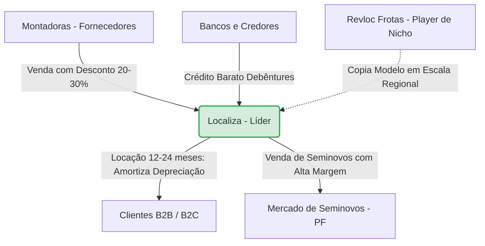

# Anotação: A Arbitragem Sistêmica da Localiza (RENT3) e a Estratégia da Revloc Frotas sob a Ótica da Teoria dos Jogos

Esta anotação analisa o modelo de negócios das locadoras de veículos no Brasil, integrando os dados financeiros da líder de mercado **Localiza Rent a Car (RENT3)** — conforme o estudo de caso da UFPB (2022) — e aplicando conceitos de **Teoria dos Jogos** e **Análise Fundamentalista** para guiar a operação e a avaliação estratégica da **Revloc Frotas**.

---

## 1. A Superestrutura do Setor e a Fusão Localiza-Unidas (RENT3)

O setor de locação de veículos no Brasil passou por uma consolidação agressiva. O cenário estudado em 2022 revela uma assimetria competitiva estrutural:

*   **Fusão Estratégica (RENT3 + LCAM3):** Concluída em 2022 após aprovação do CADE (com o remédio antitruste de vender cerca de 10% dos ativos da Unidas para a Brookfield/Ouro Verde), a fusão isolou a Localiza como líder absoluta, deixando a Movida (MOVI3) como principal desafiante direta em Rent a Car (RAC) e a Vamos (VAMO3) dominante no nicho de veículos pesados (caminhões e máquinas).
*   **Margens e Retornos Comparados (Dados Históricos de 2022):**
    *   **Localiza (RENT3):** Margem Líquida de **12,3% a 14%** e ROE de **22,50%** (chegando a **33%** em 2021).
    *   **Unidas (LCAM3 - Pré-fusão):** Margem Líquida de **9,6%**.
    *   **Movida (MOVI3):** Margem Líquida de **8%** (com maior alavancagem financeira).
    *   **Vamos (VAMO3):** Margem Líquida de **26,3%** (nicho de frota pesada, com contratos de longo prazo e menor giro de frota).
    *   **Mediana do Setor:** **10,0%**.

> [!NOTE]
> A Localiza mantém margens sistematicamente acima da mediana do setor devido ao seu poder de barganha de escala e à eficiência de sua estrutura de capital (baixo custo de captação de dívida).

---

## 2. O Jogo da Locação sob a Ótica da Teoria dos Jogos

Aplicando a **Tríade do Jogo** (Jogadores, Regras e Incentivos) e as teorias de cooperação e competição no ecossistema:

### A. Os Jogadores (Atores no Tabuleiro)
1.  **Líder Dominante (Localiza):** Controla mais de 1/3 do mercado nacional. Dita as regras tarifárias e a velocidade de renovação da frota.
2.  **Desafiantes Escalonados (Movida / Grupo Unidas-Ouro Verde):** Competem por faturamento, mas frequentemente sacrificam margem ao tomar dívidas mais caras.
3.  **Montadoras (Fiat, VW, GM, etc.):** Fornecedores de hardware físico. Buscam fluxo constante de fabricação para evitar estoques parados.
4.  **Bancos e Credores:** Fornecem o oxigênio financeiro (capital). Beneficiam os players de menor risco com taxas de juros reduzidas (WACC menor).
5.  **Revloc Frotas (Player de Nicho / Startup):** Busca se posicionar de forma ágil em frotas regionais ou segmentos especializados.

### B. As Regras do Jogo (Restrições)
*   **Barganha de Escala (Compra no Atacado):** Montadoras vendem lotes corporativos para grandes locadoras com descontos avassaladores (20% a 30% abaixo da Tabela FIPE). Pequenos players pagam preço de varejo, iniciando o jogo com desvantagem patrimonial.
*   **Custo do Capital (Captação de Dívida):** O negócio é intensivo em capital (Capex). As regras favorecem quem tem melhores ratings de crédito para emitir debêntures baratas. A Localiza protege sua liquidez extrema (Liquidez Geral de **1,58** e Liquidez Imediata de **1,01** em 2021) para sinalizar segurança máxima aos credores.
*   **Janela de Arbitragem Física:** O veículo deve rodar em locação apenas durante o período ótimo de depreciação (12 a 24 meses). Passado esse tempo, o custo de manutenção preventiva/corretiva dispara, corrompendo a margem do seminovo.

### C. Os Incentivos (Matriz de Payoffs)
*   **O "Markup" Oculto:** O verdadeiro ganho não está no *spread* do aluguel diário (que apenas cobre o custo operacional e a depreciação física). O incentivo real é a **arbitragem de hardware físico**: comprar com superdesconto de atacado das montadoras, rodar o veículo alugado (financiando sua perda de valor) e revendê-lo no varejo de seminovos pelo valor de mercado (próximo à FIPE), embolsando a margem da diferença.
*   **Equilíbrio de Nash Assimétrico:** As montadoras precisam do volume das locadoras para escoar sua produção industrial (preceito da maximização de volume). As locadoras precisam das montadoras para alimentar seu canal de Seminovos. O equilíbrio resultante é uma barreira de entrada intransponível para quem não possui escala: montadoras não oferecem descontos a novatos, e bancos não dão juros baixos para quem não tem frotas colaterais expressivas.

---

## 3. O Direcionamento para o Analista de Operações da Revloc

Como analista, você deve operar utilizando os conceitos de **Métricas de Qualidade** e o **Princípio de Maximização** (alcançar eficiência com o menor esforço/desperdício possível):

1.  **Combater a Ociosidade (Turnaround Time - TMT):** Um carro no pátio é um ativo depreciando sem gerar receita (vazamento de caixa). Mapeie o tempo de preparação (lavagem, mecânica, vistoria) e reduza-o. No Power BI, calcule:
    $$\text{Dias Ociosos} = \text{Data da Nova Locação} - \text{Data de Devolução}$$
2.  **Mapear o "Impermanent Loss" Operacional:** Identifique perdas silenciosas, como multas não indicadas a tempo (gerando perda de desconto ou cobrança duplicada no CNPJ), avarias de clientes corporativos não faturadas na devolução, e ociosidade excessiva em oficinas terceirizadas.
3.  **Estabelecer Conexão de Coesão (Soma-Positiva):** Impeça que o setor Comercial (focado em volume de contratos/diárias) e o setor Operacional (focado em preservação de veículos e custos de manutenção) joguem um jogo de soma-zero. Use dashboards integrados que mostrem o lucro real por contrato (*Yield* líquido), e não apenas o volume bruto de faturamento.

---

## 4. Guia Prático: Como Fazer a Análise Fundamentalista da Revloc

Para analisar a saúde financeira e operacional da **Revloc Frotas** de forma rigorosa, siga este roteiro de análise fundamentalista adaptado do modelo acadêmico UFPB (2022):

### Passo 1: Análise Macro e Setorial (A Superestrutura)
Antes de abrir as planilhas da empresa, analise o macroambiente:
*   **Curva de Juros (Taxa Selic):** Como a locação de frotas exige captação de recursos via dívida, um cenário de juros altos eleva o custo financeiro (despesa financeira na DRE) e pressiona o lucro líquido.
*   **Dinâmica do Setor Automotivo:** Monitore a produção de veículos novos e a Tabela FIPE de Seminovos. Se o preço do carro novo sobe, o seminovo da locadora se valoriza, gerando ganhos extraordinários na venda de frotas antigas. Se há excesso de estoque nas fábricas, o desconto de atacado aumenta.

### Passo 2: Análise de Liquidez (Risco de Curto Prazo)
A liquidez mede se a Revloc tem fôlego para pagar seus compromissos imediatos (renovação da frota, pagamento de juros de debêntures e empréstimos). Use as fórmulas aplicadas à Localiza:

| Indicador | Fórmula | O que indica na Revloc |
| :--- | :--- | :--- |
| **Liquidez Corrente (LC)** | $\frac{\text{Ativo Circulante}}{\text{Passivo Circulante}}$ | Se a empresa possui recursos conversíveis em caixa no curto prazo (ex: contas a receber de frotas corporativas, estoque de seminovos prontos para venda) superiores às dívidas com vencimento em até 12 meses. O ideal é manter **> 1,2**. |
| **Liquidez Geral (LG)** | $\frac{\text{Ativo Circulante + Realizável a Longo Prazo}}{\text{Passivo Circulante + Exigível a Longo Prazo}}$ | Avalia a solvência estrutural de médio e longo prazo da locadora. |
| **Liquidez Imediata (LI)** | $\frac{\text{Disponível (Caixa e Bancos)}}{\text{Passivo Circulante}}$ | A capacidade de pagar as dívidas imediatas apenas com o dinheiro em caixa. Evita o risco de liquidez em caso de travamento temporário no mercado de crédito. |

### Passo 3: Análise de Endividamento e Imobilização (Estrutura de Capital)
As locadoras carregam frotas gigantescas (Ativo Imobilizado) financiadas por terceiros. A análise fundamentalista deve calibrar o risco dessa estrutura:
*   **Grau de Endividamento (GE):**
    $$GE = \frac{\text{Passivo Não Circulante (PNC) + Passivo Circulante (PC)}}{\text{Patrimônio Líquido (PL)}}$$
    *Um índice muito alto indica excesso de alavancagem. O ideal da Localiza está em torno de **2,3** a **2,5**.*
*   **Imobilização do Patrimônio Líquido (IPL):**
    $$IPL = \frac{\text{Ativo Não Circulante}}{\text{Patrimônio Líquido}}$$
    *Demonstra o quanto dos recursos próprios da empresa está travado em carros e pátios. Nas locadoras, o IPL costuma ser alto (> 2,0), exigindo que a empresa recorra a capital de terceiros de longo prazo (IRNC) para financiar o giro operacional.*

### Passo 4: Mapeamento de Rentabilidade e Eficiência
Aqui avalia-se se o "jogo de arbitragem" da Revloc está gerando valor econômico real:
*   **Margem Operacional da Locação (EBITDA Margin):**
    $$\text{Margem EBITDA} = \frac{\text{EBITDA da Locação}}{\text{Receita Líquida da Locação}}$$
    *Mede a eficiência operacional pura do aluguel de frotas (diárias cobradas menos custos de manutenção, pessoal e seguros), desconsiderando a depreciação e o resultado financeiro.*
*   **Depreciação Média por Carro:**
    É o custo invisível mais importante. Deve-se dividir a depreciação anual da frota contábil pelo número médio de carros. Se a depreciação estiver muito baixa na contabilidade, o lucro atual parecerá inflado, mas haverá prejuízo na venda de seminovos no futuro.
*   **ROIC (Retorno sobre o Capital Investido) e o Spread Financeiro:**
    $$ROIC = \frac{\text{EBIT (Lucro Operacional) pós Impostos}}{\text{Dívida Líquida + Patrimônio Líquido}}$$
    *   **Regra Fundamentalista de Ouro:** O ROIC da Revloc deve ser superior ao seu Custo Médio Ponderado de Capital (WACC / Custo da Dívida). Se o ROIC for de 12% e o custo médio da dívida for de 14%, a Revloc está destruindo valor ao expandir sua frota. A Localiza historicamente mantém o ROIC acima do WACC (gerando spread positivo expressivo).
*   **Margem de Seminovos:**
    $$\text{Margem Seminovos} = \frac{\text{Receita de Seminovos} - \text{Custo dos Carros Vendidos}}{\text{Receita de Seminovos}}$$
    *Mede a eficiência do canal de desmobilização e revenda direta ao consumidor final. Se for negativa ou muito baixa, indica que a empresa está comprando mal das montadoras ou depreciando incorretamente os veículos durante o período de locação.*

---

## 5. Diagnóstico Estratégico: O Jogo do Run-off (Liquidação) vs. A Salvação da Revloc

Diante do comportamento observado (cessação de Capex para novos veículos, desmobilização total da frota à medida que os contratos expiram e falta de prospecção ativa de novos clientes), a Revloc **não está jogando um jogo de crescimento**. 

Sob a ótica financeira e da Teoria dos Jogos, a empresa está em processo de **Run-off (Liquidação Controlada de Carteira)**. Vamos analisar os incentivos ocultos por trás dessa decisão e as alternativas de "salvação" da empresa.

### A. Por que o Gestor/Acionistas estão liquidando a frota? (Os Incentivos do Run-off)
1.  **Custo de Oportunidade e Destruição de Valor (WACC > ROIC):** Como a Revloc não possui o poder de escala da Localiza para comprar carros 0km com 30% de desconto e emitir dívida barata (rating AAA), comprar novos veículos hoje significaria captar recursos a taxas proibitivas. Se o retorno estimado do aluguel (ROIC) for menor que o custo dessa nova dívida, **comprar novos carros destruiria o patrimônio dos donos**. A decisão de parar de comprar é matematicamente racional para os sócios.
2.  **Maximização de Caixa Livre (FCFE) no Curto Prazo:** Ao encerrar os contratos e vender os veículos (adquiridos originalmente da Stoller de forma mais barata), a empresa zera o Capex de renovação. O fluxo de caixa gerado pela venda dos seminovos vai direto para o caixa livre dos sócios. É o jogo de "extrair o leite da vaca até o fim" (*Harvesting*).
3.  **Arbitragem Reversa de Ativos:** Se os veículos antigos (ex-Stoller) já estão totalmente depreciados na contabilidade, vendê-los agora no mercado secundário (que se manteve com preços inflados de seminovos) permite capturar um ganho de capital limpo, sem o risco de manter carros velhos cuja manutenção corretiva passaria a corroer toda a margem operacional.

### B. Qual é o futuro da Revloc sob este cenário?
Se o plano atual for mantido, a empresa tem uma **vida útil finita**. 
*   **Fase Final:** O último contrato de locação herdado se encerrará, o último carro da frota será vendido, e a operação de locação será desativada.
*   **Resultado:** O "futuro" da empresa será puramente a liquidez gerada (o caixa líquido resultante das vendas após pagamento de impostos, passivos trabalhistas e quitação de dívidas financeiras). Ela deixará de ser uma empresa operacional e se tornará uma holding de patrimônio a ser distribuído ou reinvestido pelos sócios em outros negócios com maior ROIC.

### C. Qual seria a "Salvação" da Revloc? (Alternativas de Pivotagem)
Se a intenção dos sócios for manter a empresa ativa e viável a longo prazo, existem apenas três caminhos estratégicos viáveis para escapar da morte por desmobilização:

1.  **Pivot para Modelo Asset-Light (Gestão de Frotas como Serviço / SaaS):**
    *   **Como funciona:** A Revloc para de comprar e possuir carros (Capex zero). Ela passa a atuar na **gestão operacional de frotas de terceiros**. 
    *   **Incentivo:** A empresa vende sua expertise em manutenção, controle de multas, sinistros e roteirização (usando inteligência de dados/Power BI) para empresas que possuem frota própria mas não sabem geri-las com eficiência.
2.  **Arbitragem de Sublocação (Brokerage):**
    *   **Como funciona:** A Revloc aluga lotes de carros de gigantes como a Localiza a taxas corporativas muito baixas e os subloca para clientes locais B2B, adicionando serviços que as grandes locadoras não querem oferecer (ex: personalização extrema de veículos, motorista dedicado, atendimento em 15 minutos). 
    *   **Incentivo:** Transforma Capex fixo em Opex variável, eliminando o risco do endividamento e da depreciação dos carros.
3.  **Venda de Carteira / M&A (Fusão e Aquisição):**
    *   **Como funciona:** Vender os contratos ativos restantes e o relacionamento com a base de clientes (o *Goodwill* da empresa) para uma locadora média regional antes que eles se encerrem de vez.
    *   **Incentivo:** Capturar valor intangível da carteira, em vez de simplesmente deixar os contratos expirarem de graça.

---

## 6. Próximos Passos e Aplicação Operacional

Como Analista de Operações neste contexto de Run-off, sua postura deve se adaptar para **proteger o valor de liquidação** e demonstrar competência em cenários de reestruturação:

1.  **Estanque os Vazamentos de Caixa de Saída:** A cada veículo desmobilizado para venda, garanta que todos os sinistros antigos, avarias corporativas e multas do cliente daquele contrato sejam cobrados e faturados rigorosamente antes do encerramento contratual. Qualquer cobrança perdida é dinheiro saindo diretamente do bolso da empresa.
2.  **Otimize o Preço de Venda do Ativo:** Monte um painel no Power BI que cruze a depreciação acumulada gerencial com o valor real de mercado (FIPE vs. Webmotors) de cada veículo ex-Stoller, garantindo que o setor de desmobilização venda pelo maior markup possível.
3.  **Desenvolva o Plano de Pivotagem Asset-Light:** Use sua capacidade de análise operacional para desenhar uma proposta comercial para o seu gestor: demonstrar como a Revloc poderia vender o "serviço de gestão de frotas" para os mesmos clientes cujos contratos de locação física estão se encerrando, mantendo o relacionamento comercial ativo sem precisar investir em novos carros.

