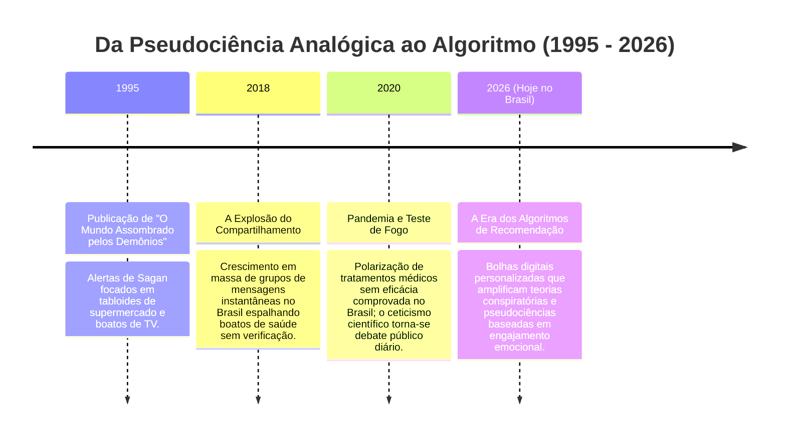

# Plano de Estudos: O Mundo Assombrado pelos Demônios
*Um guia dinâmico conectando as ideias de Carl Sagan (Capítulo 1) ao cenário brasileiro de 2026*

---

## 1. Mapeamento de Conceitos (Capítulo 1: A Coisa Mais Preciosa)

Carl Sagan estabelece bases fundamentais para diferenciar a busca sistemática pela verdade de ilusões reconfortantes. Abaixo estão os conceitos centrais extraídos do primeiro capítulo:

| Conceito | Definição da Obra | Impacto Social |
| :--- | :--- | :--- |
| **Ceticismo Científico** | Questionamento constante, exigência de evidências empíricas e teste de hipóteses antes de aceitar uma afirmação como verdade. | Protege o indivíduo de fraudes, manipulações comerciais e demagogia política. |
| **Admiração/Maravilhamento** | Sentimento de reverência e fascínio perante a vastidão e complexidade do universo reveladas pela natureza. | Impulsiona a curiosidade e o desejo de fazer ciência pura. |
| **Pseudociência** | Crenças ou práticas que alegam ser científicas, mas violam o método científico, carecem de evidências e evitam testes que possam refutá-las. | Preenche vazios emocionais e intelectuais com falsas respostas rápidas. |
| **Analfabetismo Científico** | Incapacidade de compreender conceitos científicos básicos, estatísticas e, principalmente, o funcionamento do método de investigação. | Deixa a população vulnerável a boatos, pânicos morais e decisões políticas desastrosas. |
| **Lei de Gresham (aplicada à cultura)** | Ideia adaptada da economia de que a "ciência ruim expulsa a boa" na mídia e cultura popular por ser mais fácil de consumir. | Notícias sensacionalistas e teorias conspiratórias ganham mais cliques do que estudos rigorosos. |
| **Deus das Lacunas (God of the Gaps)** | Tendência histórica de atribuir à intervenção divina ou sobrenatural tudo aquilo que a ciência ainda não consegue explicar. | Encolhe à medida que o conhecimento médico e científico avança (ex: entender a epilepsia como doença física e não possessão). |

---

## 2. Linha do Tempo: A Evolução da Credulidade à Era da Informação (1995 - 2026)

Esta linha do tempo conecta os alertas originais da publicação do livro às dinâmicas observadas no **Brasil em 2026**.

### Análise do Cenário Atual (Brasil, 2026)
*   **A "Lei de Gresham" no Reels/TikTok:** Vídeos curtos de 15 segundos prometendo curas quânticas, dietas milagrosas e teorias de conspiração geram engajamento massivo devido aos algoritmos de recomendação, sufocando canais de divulgação científica séria.
*   **Tratamentos Alternativos e Saúde:** O avanço da medicina personalizada coexiste com um mercado crescente de terapias alternativas sem comprovação, muitas vezes validadas por discursos pseudo-espirituais ou "ciência quântica" distorcida.
*   **A Escassez de Filtros de Verificação:** A velocidade das notícias supera a capacidade de filtragem do cidadão médio, tornando o "Kit de Detecção de Mentiras" de Sagan mais urgente do que nunca.

---

## 3. Desafio de Entendimento (Capítulo 1)

*Responda a estas questões para avaliar sua absorção antes de passarmos para o próximo capítulo.*

### Pergunta 1:
No início do capítulo, Carl Sagan descreve a empolgação do motorista de táxi ao falar sobre extraterrestres congelados, Atlântida e cristais, mas nota que ele não sabia nada sobre mecânica quântica, DNA ou placas tectônicas. 
*   **O que essa diferença de conhecimento revela sobre a nossa sociedade e a forma como a ciência é comunicada?**

### Pergunta 2:
Sagan afirma que *"a pseudociência é adotada na mesma proporção em que a verdadeira ciência é mal compreendida"*.
*   **Como essa frase se aplica às fake news de saúde e tratamentos milagrosos compartilhados nas redes sociais brasileiras em 2026?**

### Pergunta 3:
Diferente da pseudociência, que busca dar certezas absolutas, a ciência convive com margens de erro e correções constantes.
*   **Por que a necessidade humana de segurança emocional torna as narrativas pseudocientíficas mais atraentes do que as respostas científicas?**
